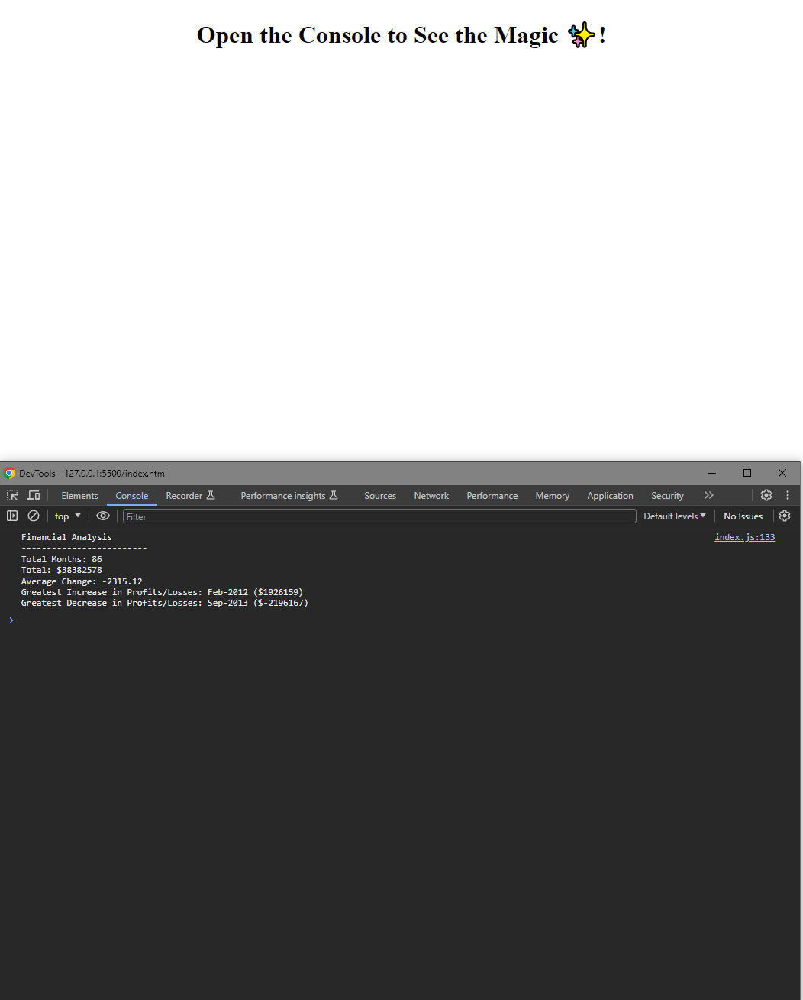

# Console-Finances

## Description
This is a small project to analyze financial records of the company. The analysis is done using `for` loops and `if` statements to navigate through the provided data. The primary goal is to calculate various financial metrics and highlight key insights.

Working on this project was very engaging experiece as it required me to consider how to handle and analyze data I was provided with.

## Installation

N/A

## Usage

Link to the website: https://michaltrostowiecki.github.io/Console-Finances/

## Credits

N/A

## License

This project is licensed under the MIT License - see the [LICENSE](LICENSE) file for details.